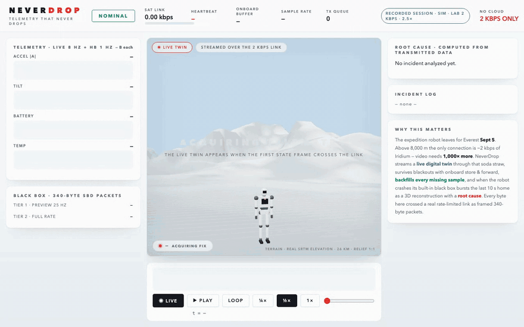
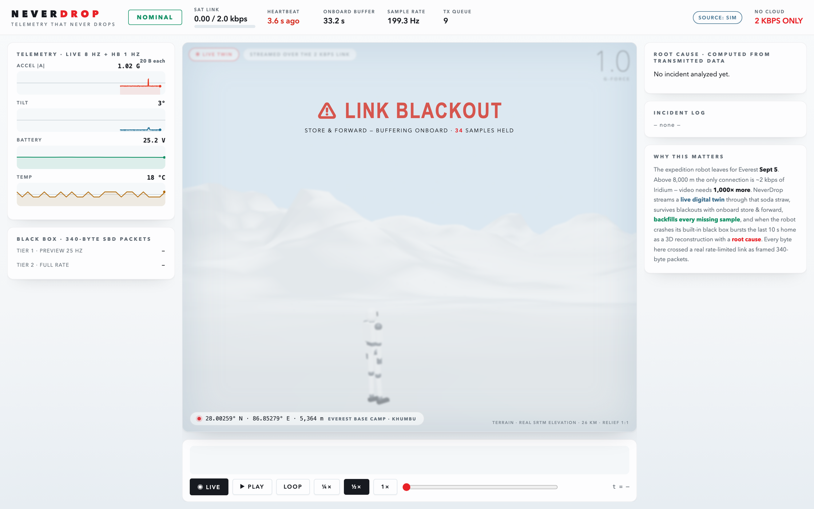
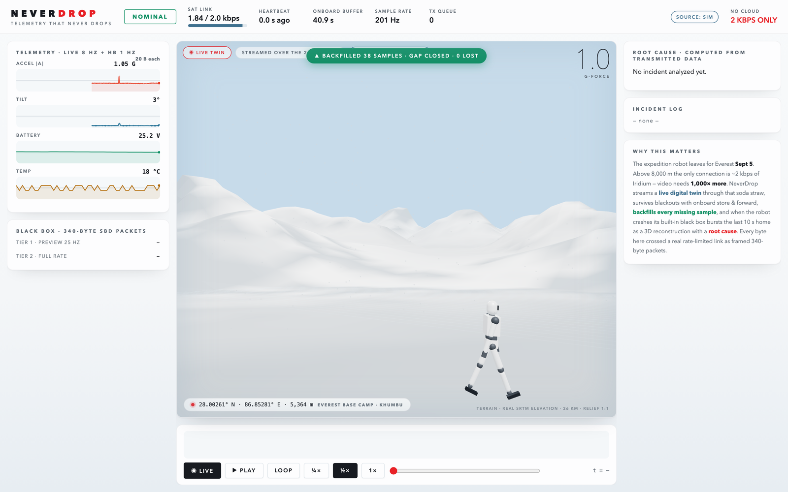
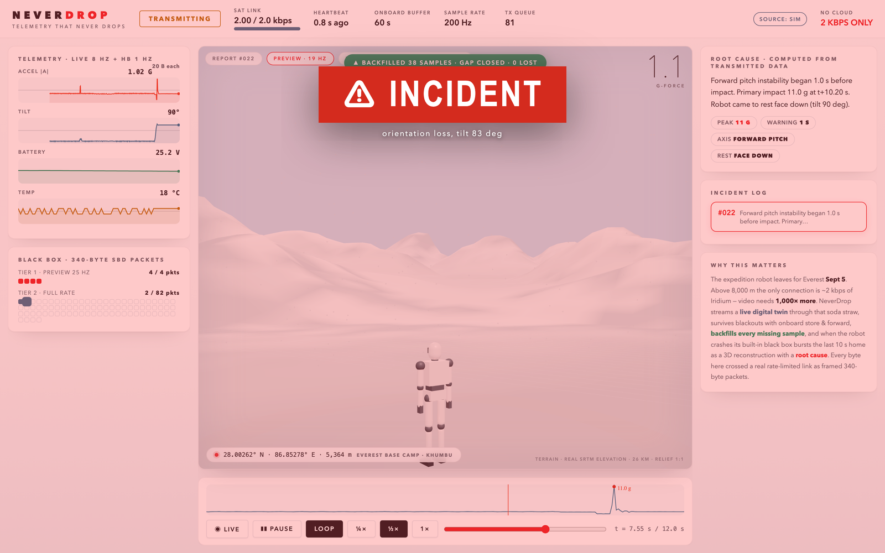
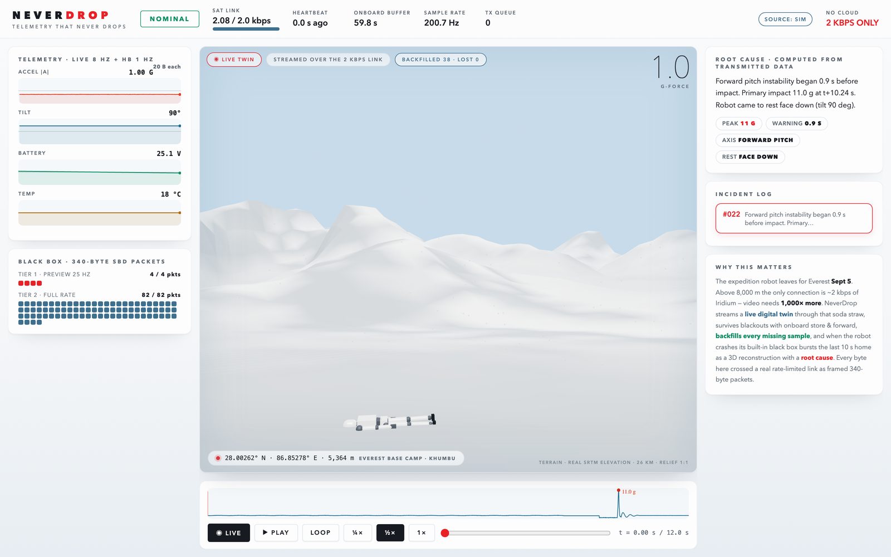
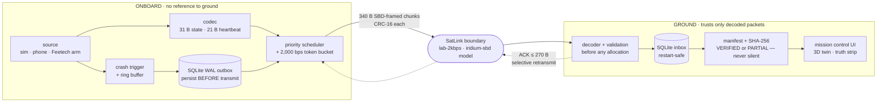
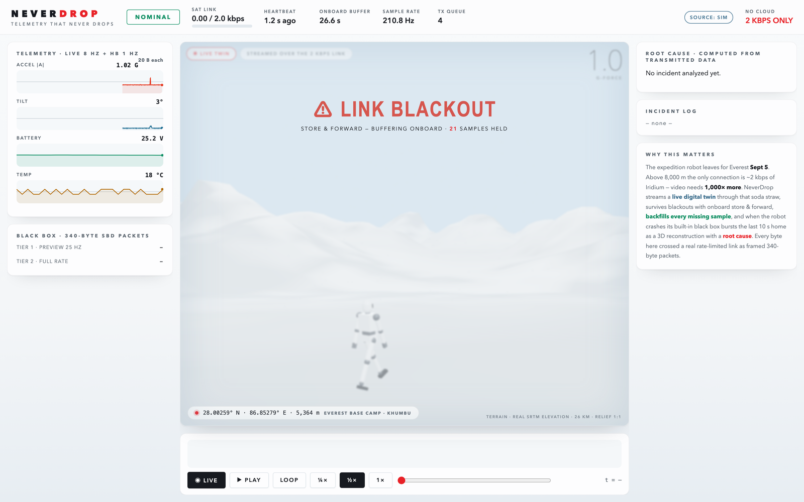

<div align="center">


### Mission control for robots beyond the cloud

**A live base-state twin · manifest-verified store-and-forward telemetry ·
a flight-recorder black box — squeezed through 2,000 bits per second,
and honest about every byte.**

[](https://github.com/vnmoorthy/neverdrop/actions/workflows/ci.yml)
[](test_reliability.py)
[](CLAIMS_AND_EVIDENCE.md)
[](PROTOCOL.md)
[](LICENSE)

### **[▶ &nbsp;OPEN THE DEMO](https://vnmoorthy.github.io/neverdrop/)**

*Not a video — a real captured session replayed through the actual
mission-control UI, with chapter navigation. Sim source, lab 2 kbps
model, and it says so on screen.*



*One minute of the recorded session: the twin walks its traverse, the link
dies, the robot buffers onboard, the gap backfills — verified — and then
it crashes and the black box comes home.*

[protocol](PROTOCOL.md) · [failure matrix](FAILURE_MATRIX.md) ·
[claims & evidence](CLAIMS_AND_EVIDENCE.md) · [deployment](DEPLOYMENT.md) ·
[demo runbook](DEMO_RUNBOOK.md)

</div>

---

## The soda-straw problem

On September 5 the [Robot Everest](https://www.roboteverest.com/) expedition
sends a humanoid toward the summit. Above 8,000 m there is no LTE, no Wi-Fi,
no cloud — the only uplink is **~2 kbps of Iridium**. Video needs a thousand
times more. A robot dashboard built on broadband assumptions shows a spinner.

NeverDrop is mission control built for the straw instead of the fire hose:

| At 2,000 bit/s you cannot have… | …so NeverDrop gives you |
|---|---|
| video | a **live 3D twin** driven by 31-byte state frames at 7 Hz |
| a reliable pipe | **store-and-forward** with a transmitted manifest + SHA-256, so "zero loss" is *proved*, never claimed |
| a debugger on the mountain | a **black box**: the last 10 s of every crash persisted onboard, then burst home as 340-byte SBD-compatible chunks |
| optimism | a **truth strip**: source (SYNTHETIC vs REAL MEASUREMENT), link profile, `SATELLITE HARDWARE: NONE` — on screen at all times |

Built at the **Himalaya Robotics Hack 2026 · San Francisco**, over a
constrained *lab model* of the link — no cloud, no CDN, no satellite
hardware, and the UI says so.

## The session in four beats

| | |
|:---:|:---:|
|  |  |
| **Cut the link.** Live state stops; the robot keeps recording to bounded disk-backed storage. The UI counts the samples being held onboard. | **Restore it.** The blackout is declared in a transmitted manifest (chunk count, samples, rate, SHA-256) — then backfills: `GAP CLOSED · 0 LOST`. |
|  |  |
| **Crash it.** The trigger fires onboard, the last 10 s persist to a SQLite outbox *before first transmission*, and the klaxon you see arrives as decoded link packets — not local state. | **Read the black box.** Tier-1 preview in seconds, tier-2 refined at full 200 Hz; the twin replays the fall on real SRTM terrain of the Everest massif. |

## What it does (and what each claim means)

1. **Live base-state twin.** Attitude quaternion, peak |a|, tilt, x/y
   dead-reckoned position and optional joint angles stream as **31-byte
   frames at 7 Hz** (43 B / 5 Hz with 6 joints) — 1,904 bps including
   21-byte heartbeats, inside a 2,000 bps budget. This is *base state*,
   not full pose, and the numbers come from
   `python -m icebox.protocol_stats`, not prose.
2. **Verified store-and-forward.** During a blackout, current status
   coalesces (latest value wins — no stale replay) while durable data
   records to bounded disk-backed storage. On restore, the blackout is
   declared in a **transmitted manifest** (chunk count, sample count,
   declared 12.5 Hz resolution, SHA-256) and the UI shows
   `RECEIVING x/y` → `BACKFILL VERIFIED · HASH OK`. Zero-loss language
   appears **only** with that proof.
3. **Black box with delivery guarantees.** A crash triggers onboard; the
   last 10 s persist to a SQLite outbox **before first transmission**,
   then ship as 340-byte SBD-compatible chunks with manifest + ACK-driven
   selective retransmit on a ≤270-byte reverse channel. Tier-1 preview
   first (PRELIMINARY analysis), tier-2 refines it. Retry policy is
   finite and ends in an explicit `PARTIAL_FAILED` — never a silent
   drop. Both ends survive restarts and complete exactly once.
4. **Truth boundary.** The onboard process holds no reference to ground.
   Every incident fact on the dashboard — id, cause, chunk counts,
   analysis — arrives as decoded link packets tagged `via:"link"`; local
   demo controls live in a panel labeled `LOCAL TEST HARNESS · NEVER
   TRANSMITTED`. A dedicated test proves ground can't learn incident
   details any other way.

## How the bytes flow



Priority under contention: durable control → heartbeat slot → live-state
slot → durable chunks (tier-1, then backfill, then tier-2), with a
starvation guard. Full wire format, ACK semantics, and integrity model:
[PROTOCOL.md](PROTOCOL.md).

## The numbers

| Message | Size on the wire |
|---|---|
| HEARTBEAT | 21 B |
| STATE (0 joints / 6 joints) | 31 B / 43 B |
| INCIDENT_NOTICE | 22 B |
| REPORT_MANIFEST | 59 B |
| REPORT_CHUNK (header / payload / total) | 12 / 328 / **340 B** — SBD MO limit |
| ACK, worst case (100 missing chunks) | 227 B — under the 270 B SBD MT limit |

Steady state: 1,904 bps of the 2,000 bps budget (95.2%); the pacer never
exceeds it (measured 1,945 bps under contention, test t13). Every figure
above is derivable from the actual structs at any time:

```bash
python -m icebox.protocol_stats
```

## Run it in sixty seconds

```bash
git clone https://github.com/vnmoorthy/neverdrop && cd neverdrop
python -m icebox.server --role all --source sim
```

Open `http://localhost:8000`, then break things: cut the link, watch the
backfill verify, hit the fall trigger, read the black box. Other modes:

```bash
python -m icebox.server --role all --source arm                # real Feetech arm
python -m icebox.server --role ground --port 8000 --listen-port 47700
python -m icebox.server --role onboard --source sim --ground-host <ip> --ground-port 47700
python -m icebox.server --role all --source sim --link-profile iridium-sbd --sbd-latency 12 --seed 7
```

The truth strip at the top declares the source (SYNTHETIC vs REAL
MEASUREMENT), the link profile (LAB 2 KBPS MODEL or IRIDIUM SBD
OPERATIONAL MODEL), `SATELLITE HARDWARE: NONE`, and live report
coverage/integrity. Black-box archives are inspectable files:

```bash
python -m icebox.inspect_report reports/report_00001.ndz
python -m icebox.replay_report  reports/report_00001.ndz
```

## Break it yourself

Sixteen documented failure modes, each pinned by a deterministic, seeded
test — blackouts, 10% loss, 60% reordering, duplication, payload
corruption, hostile headers, missing final chunks, restarts on *both*
ends mid-transfer ([the full matrix](FAILURE_MATRIX.md)):

```bash
python3 -m venv .venv && .venv/bin/pip install aiohttp
.venv/bin/python test_blackbox.py         # codec/trigger/framing: ALL PASS
.venv/bin/python test_reliability.py      # 14 failure scenarios: ALL PASS
.venv/bin/python test_split_roles.py      # separate OS processes: ALL PASS
```

Phone-mode end-to-end (synthetic Sensor Logger fixture — clearly labeled;
we did not fabricate a "real" trace):

```bash
.venv/bin/python -m icebox.server --source phone --port 8010 &
.venv/bin/python test_phone_e2e.py        # PHONE E2E: ALL PASS
```

All of it runs in CI on every push. Every capability claim in this README
maps to a test or a measurement in
[CLAIMS_AND_EVIDENCE.md](CLAIMS_AND_EVIDENCE.md).

## Hardware status (evidence-based)

- **Arm — REAL, partially exercised**: a physical 6-servo Feetech bus is
  integrated (auto-detected, 1 Mbaud, 6.3 ms read cycle measured, reads in
  a worker thread); live joint state streams end-to-end. The grab-incident
  flow on hardware awaits a human yank.
- **Phone — pipeline proven on a synthetic fixture** (time-alignment,
  staleness gates, quaternion validation tested); a live phone run is
  pending.
- **Jetson / satellite modem — NOT integrated.** `SatLink` is the modem
  boundary; the SBD profile models message-session behavior with the real
  340/270-byte limits and a configurable (default 8 s, assumption)
  session latency.
- Battery/temperature are **NOT MEASURED** on phone/arm sources and the UI
  says so; simulated values appear only with the sim source.

## Incident analysis, honestly

The ground computes a **mechanism hypothesis** from received IMU/joint
data: event type, peak g, free-fall estimate, dominant axis, final
attitude — with a confidence score, coverage, an explicit limitations list
(no actuator state, no contact sensing, no terrain/wind data) and
alternative hypotheses. Tier-1 output is labeled PRELIMINARY; tier-2
REFINED. It is not called a root cause, because IMU telemetry alone cannot
establish one.

## The 3D scene



Terrain is real SRTM elevation of the Everest massif (26 km patch, relief
1:1, geo-verified to within one grid cell of the summit); the GPS readout
derives from a Base Camp anchor constant plus the transmitted position —
display context, not navigation. The robot render is stylized; joint
angles are the transmitted values.

## Map of the repo

| Document | What's inside |
|---|---|
| [PROTOCOL.md](PROTOCOL.md) | wire format, traffic classes, ACK semantics, priority policy, integrity model |
| [FAILURE_MATRIX.md](FAILURE_MATRIX.md) | every failure mode, its expected behavior, its test, its known limitation |
| [CLAIMS_AND_EVIDENCE.md](CLAIMS_AND_EVIDENCE.md) | each claim mapped to the test or measurement that backs it |
| [HARDENING_REPORT.md](HARDENING_REPORT.md) | what was hardened for judging, and what deliberately wasn't claimed |
| [DEPLOYMENT.md](DEPLOYMENT.md) | Jetson / field deployment notes (documented, untested) |
| [DEMO_RUNBOOK.md](DEMO_RUNBOOK.md) | the exact live-demo script, with fallbacks |

Stack: Python/asyncio + aiohttp only. SQLite WAL for both outbox and
inbox. CRC-16 per packet, SHA-256 per report. Vendored Three.js —
offline-capable, no CDN, no cloud, anywhere.

---

<div align="center">

**Built in one day at the Himalaya Robotics Hack 2026 · San Francisco**
for the [Robot Everest](https://www.roboteverest.com/) expedition's
constraint: above 8,000 m, the only uplink is ~2 kbps of Iridium.

*If a robot on a mountain shouldn't die anonymously, star the repo* ⭐

[MIT License](LICENSE)

</div>
