<div align="center">



# 📡 NeverDrop

### Mission control for robots beyond the cloud

**A live 3D digital twin · loss-proof store-and-forward telemetry · a flight-recorder black box —
all through a 2,000 bit/s satellite link. No cloud, anywhere.**

[](https://github.com/vnmoorthy/neverdrop/actions/workflows/ci.yml)
[](test_phone_e2e.py)
[](icebox/linksim.py)
[](icebox/blackbox.py)
[](requirements.txt)
[](LICENSE)

### **[▶ &nbsp;WATCH THE LIVE DEMO](https://vnmoorthy.github.io/neverdrop/)**
*a real captured session — genuine 2 kbps events replayed through the actual mission-control UI*

[demo runbook](DEMO_RUNBOOK.md) · [submission](SUBMISSION.md) · [honesty ledger](#honesty-ledger-judges-will-ask)



*Built in one day at the Himalaya Robotics Hack 2026 · San Francisco —
for the [Robot Everest](https://www.roboteverest.com/) expedition, which departs September 5.*

</div>

---

Above 8,000 m the only connection to the robot is ~2 kbps of Iridium —
video needs **1,000× more**. NeverDrop is the mission-control lifeline that
fits through that soda straw:

1. **Live digital twin** — the robot's full pose streams as 26-byte state
   frames at 8 Hz; base camp watches a 3D mirror of the machine move in
   real time on ~1.7 kbps.
2. **Store & forward that closes its own gaps** — cut the link and the
   robot buffers onboard; restore it and the blackout is compressed into
   one tier-3 segment and backfilled *behind* the live stream. The chart
   hole visibly closes: **BACKFILLED n SAMPLES · 0 LOST**.
3. **ICEBOX black box built in** — when the robot crashes, the trigger
   fires onboard and the last 10 s burst home as genuine 340-byte Iridium
   SBD packets: a scrubbable 3D crash reconstruction with an automatically
   computed root cause, ~7 s after impact.

> Fleet supervision is the bottleneck to deploying robots anywhere the
> cloud can't follow — mines, oceans, mountains, orbit. Video doesn't
> scale; state-streaming does. NeverDrop is the observability layer of the
> physical world, priced per robot per month.

## What's inside

|  |  |  |
|---|---|---|
| 🤖 **Live digital twin** — 26-byte pose frames, 8 Hz, ~1.7 kbps | 📦 **Store & forward** — blackouts buffer onboard, backfill on restore | 🧊 **Black-box crash recorder** — 10 s burst, 3D replay in ~7 s |
| 📡 **Real link discipline** — token-bucket 2 kbps UDP, 340 B SBD frames, CRC-16 | 🧠 **Root cause, computed** — impact g, free-fall, axis, rest attitude from transmitted bytes | 🦾 **Real hardware ready** — phone IMU today, Feetech serial arms via one adapter |
| 🎛️ **Priority scheduling** — heartbeats > live frames > bursts, self-throttling | 🔁 **Supersede semantics** — a new crash preempts a draining burst, backfill survives | ✅ **CI-proven** — unit suite + full phone E2E pass on every push, from a fresh clone |

## Quick start (one command)

```bash
python3 -m venv .venv && .venv/bin/pip install aiohttp
.venv/bin/python -m icebox.server --source sim
# open http://localhost:8000 → watch the twin → press "✂ CUT THE LINK"
```

Verify the whole pipeline without a browser:

```bash
.venv/bin/python test_blackbox.py     # unit + pipeline: must print ALL PASS
```

Prove phone mode end-to-end without a phone (synthetic Sensor Logger stream,
quiet phase → free-fall → 7 g impact → burst → decode → root cause):

```bash
.venv/bin/python -m icebox.server --source phone --port 8010 &
.venv/bin/python test_phone_e2e.py    # must print PHONE E2E: ALL PASS
```

## The demo beat

1. The twin moves live on the wall; the SAT LINK meter reads ~1.8 / 2.0
   kbps. *"You are watching a robot through a soda straw."*
2. **✂ CUT THE LINK.** The twin freezes under a pulsing LINK BLACKOUT
   banner; a counter shows samples buffering onboard; the charts tear a
   visible hole.
3. **▲ RESTORE LINK.** The twin snaps back live instantly; seconds later
   the compressed backlog lands and the hole in the charts closes in front
   of the audience: **BACKFILLED n · LOST 0**.
4. **Shove the robot** (or a phone strapped in a boot, `--source phone`).
   Klaxon — the ground learns of the crash from a heartbeat state bit that
   crossed the link — and ~7 s later the 3D crash reconstruction auto-plays
   with the root cause: *"Forward pitch instability began 0.9 s before
   impact. Primary impact 10.9 g. Robot came to rest face down."*
5. ◉ LIVE returns to the twin. Total bandwidth spent: kilobytes.

## Telemetry sources

| flag | what | use |
|---|---|---|
| `--source sim` | scripted humanoid + fall | rehearsal + cannot-fail fallback |
| `--source phone` | **live phone IMU** via Sensor Logger HTTP push | the twin mirrors the phone in your hand |
| `--source simarm` | simulated 6-DOF arm; TRIGGER FALL = a judge grabbing it | arm-venue rehearsal |
| `--source arm` | template adapter in `icebox/telemetry.py` | wire the venue arm SDK (20–40 min) |

**Phone setup (60 s):** install *Sensor Logger*, enable **Accelerometer +
Gyroscope + Gravity + Orientation** at 100 Hz, HTTP Push to
`http://<laptop-ip>:8000/phone`, laptop on the phone's hotspot (venue Wi-Fi
blocks phone→laptop). Verify by opening `http://<laptop-ip>:8000` in the
phone's browser first.

## Honesty ledger (judges will ask)

- Every byte on the dashboard crossed a real UDP socket paced to 2,000 bps
  by a token bucket (~100-line `icebox/linksim.py` — read it), framed
  ≤340 bytes (the true Iridium SBD MO limit), CRC-16 checked, reassembled
  out of order.
- The live twin, charts, blackout backfill, INCIDENT banner, crash replay,
  and root cause are all reconstructed **only** from what crossed that
  link. The in-process debug channel drives none of them.
- The onboard and ground halves share no state except those datagrams;
  splitting them across a Jetson Thor and a laptop is changing the
  loopback address in `linksim.py`. Tonight both run on one machine — we
  say so. What's simulated: the robot (in sim modes) and space (loopback).
  Phone mode is real motion.

## Architecture

```
ONBOARD (Jetson Thor)                      GROUND (base camp laptop)
────────────────────────                   ─────────────────────────
source (IMU / arm SDK / phone)             UDP rx ── CRC16 + reassembly
  ├─> live state frames 8 Hz · 26 B          ├─> LIVE 3D TWIN + charts
  ├─> blackout? buffer onboard ──────┐       ├─> blackout overlay
  │     restore: zlib gap segment ───┘──>    ├─> gap splice: "0 LOST"
  ├─> 1 Hz heartbeats (priority)             ├─> state pill + klaxon
  └─> crash trigger -> 10 s burst            └─> crash replay + root cause
        tier1 20 Hz preview ~1.2 KB
        tier2 200 Hz record ~24 KB      ──2 kbps token-bucket UDP──>
        340 B SBD packets
```

Built at the Himalaya Robotics Hack, Aug 29–30 2026, San Francisco.
